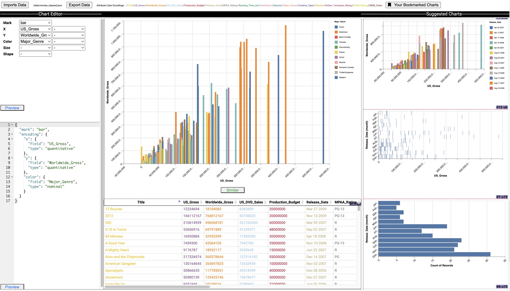

## Visualization interface 

The front-end and back-end code of the interface is under the _interface/_ folder. 

* _client/_: Front-end code for the visualization interface
* _components/_: Third party components used in the front-end
* _server/_: Back-end NodeJS server for the front-end
* _staticdata/_: Example datasets served by the NodeJS server
* _modelserver.py_: Back-end Flask server 

To build the app:
* Install python packages: pip install -r requirements.txt (suggest using virtual environment https://docs.python.org/3/tutorial/venv.html)
* Install js packages: npm install
* Build for production: npm run build:prod

To run the app:
* Start the recommendation engine (Flask server): python modelserver.py
* Start the back-end NodeJS server: npm run start:prod
* Visit: http://localhost:8000/index.html

Alternatively, for development (live code update):
* Start recommendation engine: python modelserver.py
* Start development: npm start

The app supports a JSON format input, consisting a list of charts specified in Vega-Lite and a data array for the charts. See _staticdata/_ for examples. The input data can be loaded via an url or a file upload, in the right format. Note that no format checking is performed. By default, the _cars.json_ is loaded when the app starts.   