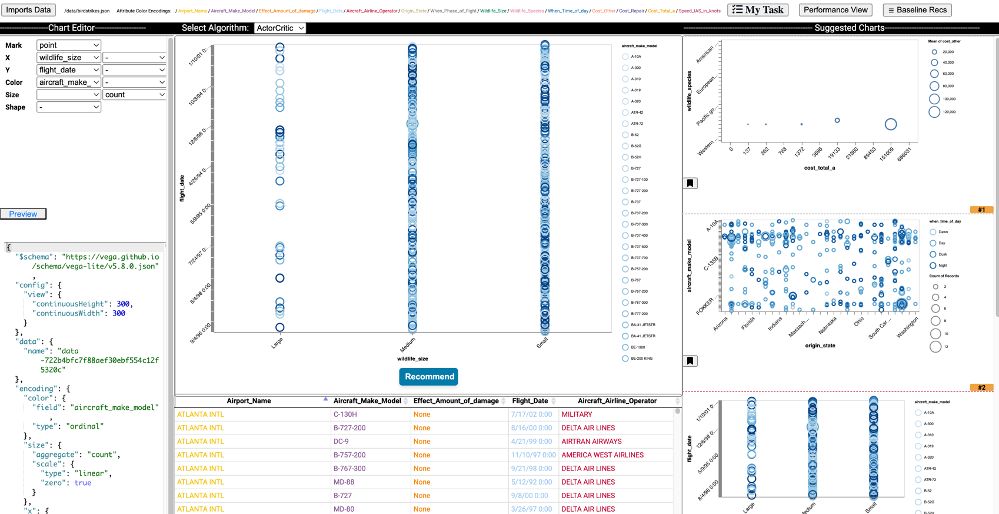

## Visualization interface 

The front-end and back-end code of the interface is under the _interface/_ folder. 

* _client/_: Front-end code for the visualization interface
* _components/_: Third party components used in the front-end
* _server/_: Back-end NodeJS server for the front-end
* _staticdata/_: Example datasets served by the NodeJS server
* _modelserver.py_: Back-end Flask server 

* Installing necessary libraries for the application (backend):
  1st. Creating a python virtual environment:
  		python3 -m venv dracovenv
  2nd. Activating the python virtual environment
  		source dracovenv/bin/activate
  3rd. Install python packages: 
      cd interface
      pip install -r requirements.txt 

* Install and build javascript packages (node), Node >= 18 required (Assuming we are in the interface directory)
	npm install
  npm run build:prod
  
To run the app (assuming we are in the interface directory):
  * Start the recommendation engine from one terminal:  ./start_backend.sh
  * Start the NodeJS server from another terminal:  ./start_frontend.sh

* Visit: http://localhost:8000

The app supports a JSON format input, consisting a list of charts specified in Vega-Lite and a data array for the charts. See _staticdata/_ for examples. The input data can be loaded via an url or a file upload, in the right format. Note that no format checking is performed. By default, the _cars.json_ is loaded when the app starts.   
